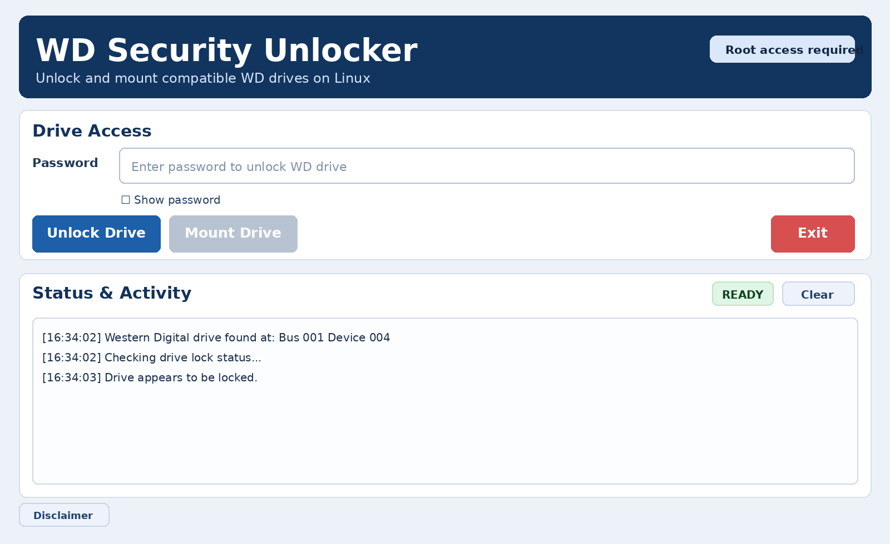
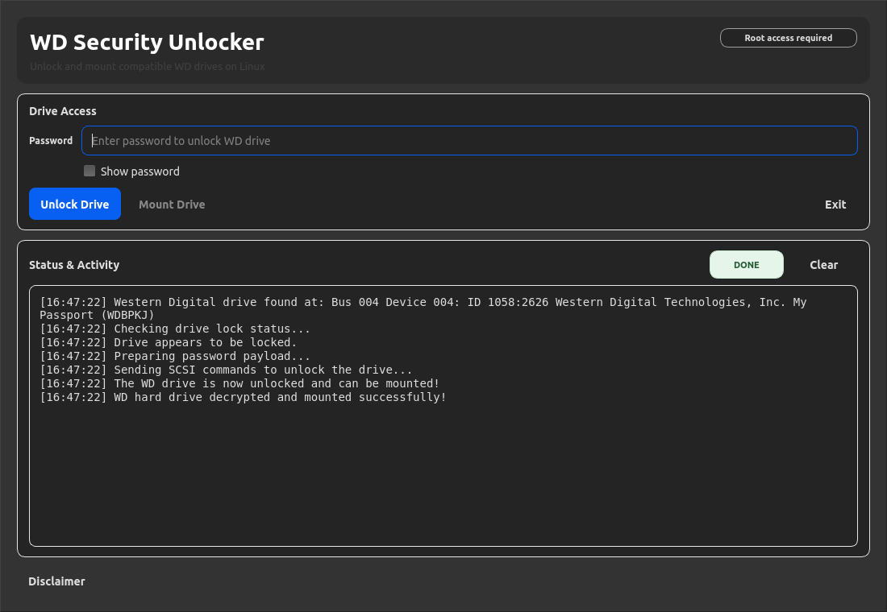

# WD Security Unlocker

A Linux desktop utility to unlock compatible WD Security-protected drives and mount them.

## Credits
- Original technical foundation: https://github.com/KenMacD/wdpassport-utils
- GUI lineage includes work by: https://github.com/electronicsguy
- This repository is published as a standalone project with additional modernization and UX/security updates.

See [NOTICE](NOTICE), [LICENSE](LICENSE), and [TERMS](TERMS.md) for attribution and usage rights.
See [AI_USAGE_POLICY](AI_USAGE_POLICY.md), [SECURITY](SECURITY.md), and [CONTRIBUTING](CONTRIBUTING.md) for policy details.

## What you can do
- Unlock a password-protected WD Security drive.
- Mount the drive immediately after unlock.
- Launch as a desktop app from your Linux app menu.

## Quick Start (Linux)
1. Install Python 3 + PyQt5.
2. `./build-linux.sh`
3. `./install-desktop-entry.sh`
4. Open **WD Security Unlocker**.

## Screenshots
### Main Screen

### Unlock Success

